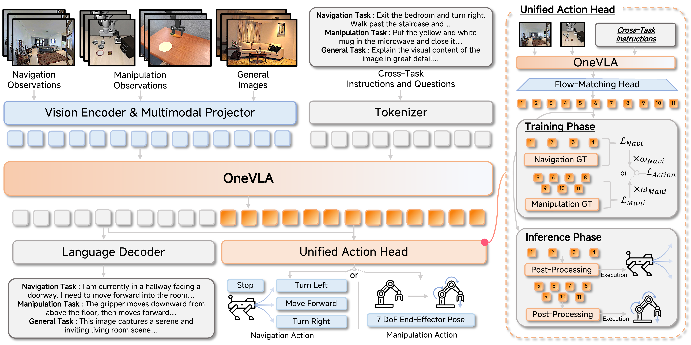

# OneVLA: A Unified Framework for Embodied Tasks

<p align="center">
  <a href=""></a>
  <a href=""></a>
</p>

<p align="center">
  
</p>

A Vision-Language-Action Model for Embodied AI, supporting both navigation and manipulation tasks.

## Environment Setup

### 1. Base Environment (Required)

```bash
conda create -n onevla python=3.10 -y
conda activate onevla

# Install PyTorch (adjust CUDA version as needed)
pip install torch==2.4.0 torchvision==0.19.0 --index-url https://download.pytorch.org/whl/cu121

# Install OneVLA
cd OneVLA
pip install -e .
pip install -r requirements.txt
```

### 2. R2R/RxR Navigation Evaluation Environment

R2R/RxR evaluation requires [Habitat-Sim v0.1.7](https://github.com/facebookresearch/habitat-sim/tree/v0.1.7) and [Habitat-Lab v0.1.7](https://github.com/facebookresearch/habitat-lab/tree/v0.1.7). The VLN-CE evaluation infrastructure is already integrated in this repo (`VLN_CE/` directory).

```bash
conda create -n onevla_vlnce python=3.9 -y
conda activate onevla_vlnce

# Install Habitat-Sim v0.1.7
conda install -c aihabitat -c conda-forge habitat-sim=0.1.7=py3.9_headless_linux_856d4b08c1a2632626bf0d205bf46471a99502b7

# Install Habitat-Lab v0.1.7
git clone --branch v0.1.7 https://github.com/facebookresearch/habitat-lab.git
cd habitat-lab
pip install -r requirements.txt
pip install -r habitat_baselines/rl/requirements.txt
pip install -r habitat_baselines/rl/ddppo/requirements.txt
python setup.py develop --all
cd ..

# Install PyTorch
pip install torch==2.4.0 torchvision==0.19.0 --index-url https://download.pytorch.org/whl/cu121

# Install OneVLA and dependencies
cd OneVLA
pip install -e .
pip install -r requirements.txt

# Install additional VLN-CE dependencies
pip install jsonlines lmdb msgpack-python networkx
```

**Data preparation**:

Download and place Matterport3D scene data and R2R episodes:
```
data/
├── datasets/
│   └── R2R_VLNCE_v1-3_preprocessed/
│       └── val_unseen/
│           └── val_unseen.json.gz
└── scene_datasets/
    └── mp3d/
        └── ...
```

Update paths in `VLN_CE/habitat_extensions/config/vlnce_task_navid_r2r.yaml` to point to your data location.

### 3. SimplerEnv Manipulation Evaluation Environment

SimplerEnv evaluation harness is already integrated in this repo (`simpler_env/` directory). You only need to install the simulation backend [ManiSkill2_real2sim](https://github.com/simpler-env/ManiSkill2_real2sim).

```bash
conda create -n onevla_simpler python=3.10 -y
conda activate onevla_simpler

# Install PyTorch
pip install torch==2.4.0 torchvision==0.19.0 --index-url https://download.pytorch.org/whl/cu121

# Install ManiSkill2 real2sim (simulation environments)
git clone https://github.com/simpler-env/ManiSkill2_real2sim.git
cd ManiSkill2_real2sim
pip install -e .
cd ..

# Install OneVLA and dependencies
cd OneVLA
pip install -e .
pip install -r requirements.txt

# Install additional SimplerEnv dependencies
pip install gymnasium sapien transforms3d mediapy
```

## Model Architecture

OneVLA uses a Qwen-VL backbone with a flow-matching action head:
- **VLM Backbone**: Qwen2.5-VL for vision-language understanding
- **Action Head**: Flow-matching based DiT (GR00T) for continuous action prediction
- **Unified Action Space**: 11-dim action space supporting both navigation and manipulation

## Checkpoint

Download the pretrained checkpoint from Hugging Face:

[https://huggingface.co/llxs/OneVLA](https://huggingface.co/llxs/OneVLA)

## Evaluation

### R2R Navigation

```bash
conda activate onevla_vlnce
bash examples/R2R/eval_r2r.sh /path/to/checkpoint.pt [stop_threshold] [chunk_stop_ratio]
```

### RxR Navigation

```bash
conda activate onevla_vlnce
bash examples/R2R/eval_rxr.sh /path/to/checkpoint.pt
```

### SimplerEnv Manipulation

```bash
conda activate onevla_simpler
bash examples/SimplerEnv/eval_simplerenv.sh /path/to/checkpoint.pt
```


## License

MIT
